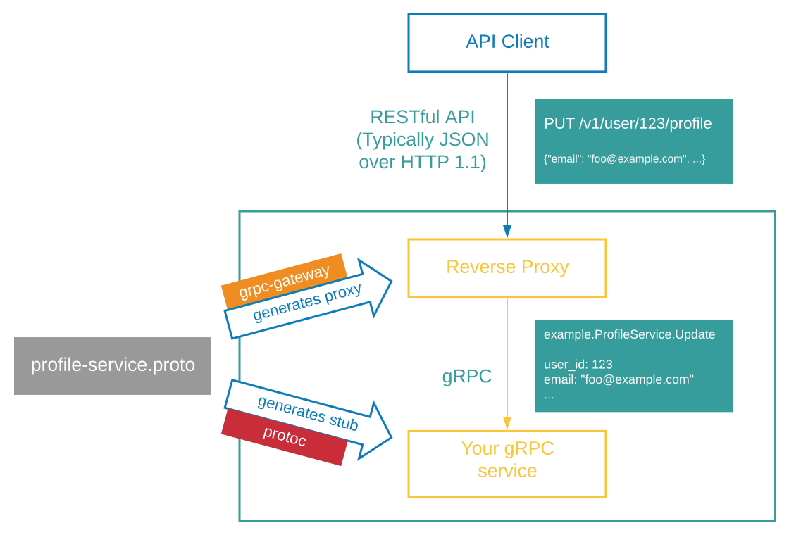

<div align="center">
<h1>gRPC-Gateway</h1>
<p>
gRPC to JSON proxy generator following the gRPC HTTP spec
</p>
<a href="https://circleci.com/gh/grpc-ecosystem/grpc-gateway"></a>
<a href="https://codecov.io/gh/grpc-ecosystem/grpc-gateway"></a>
<a href="https://app.slack.com/client/T029RQSE6/CBATURP1D"></a>
<a href="https://github.com/grpc-ecosystem/grpc-gateway/blob/master/LICENSE.txt"></a>
<a href="https://github.com/grpc-ecosystem/grpc-gateway/releases"></a>
<a href="https://github.com/grpc-ecosystem/grpc-gateway/stargazers"></a>
</div>

## About

The gRPC-Gateway is a plugin of the Google protocol buffers compiler
[protoc](https://github.com/protocolbuffers/protobuf).
It reads protobuf service definitions and generates a reverse-proxy server which
translates a RESTful HTTP API into gRPC. This server is generated according to the
[`google.api.http`](https://github.com/googleapis/googleapis/blob/master/google/api/http.proto#L46)
annotations in your service definitions.

This helps you provide your APIs in both gRPC and RESTful style at the same time.

<div align="center">

</div>

## Docs

You can read our docs at:

- https://grpc-ecosystem.github.io/grpc-gateway/

## Testimonials

> We use the gRPC-Gateway to serve millions of API requests per day,
> and have been since 2018 and through all of that,
> we have never had any issues with it.
>
> _- William Mill, [Ad Hoc](http://adhocteam.us/)_

## Background

gRPC is great -- it generates API clients and server stubs in many programming
languages, it is fast, easy-to-use, bandwidth-efficient and its design is
combat-proven by Google. However, you might still want to provide a traditional
RESTful JSON API as well. Reasons can range from maintaining
backward-compatibility, supporting languages or clients that are not well supported by
gRPC, to simply maintaining the aesthetics and tooling involved with a RESTful
JSON architecture.

This project aims to provide that HTTP+JSON interface to your gRPC service.
A small amount of configuration in your service to attach HTTP semantics is all
that's needed to generate a reverse-proxy with this library.

## Installation

The following instructions assume you are using
[Go Modules](https://github.com/golang/go/wiki/Modules) for dependency
management. Use a
[tool dependency](https://github.com/golang/go/wiki/Modules#how-can-i-track-tool-dependencies-for-a-module)
to track the versions of the following executable packages:

```go
// +build tools

package tools

import (
    _ "github.com/grpc-ecosystem/grpc-gateway/v2/protoc-gen-grpc-gateway"
    _ "github.com/grpc-ecosystem/grpc-gateway/v2/protoc-gen-openapiv2"
    _ "google.golang.org/grpc/cmd/protoc-gen-go-grpc"
    _ "google.golang.org/protobuf/cmd/protoc-gen-go"
)
```

Run `go mod tidy` to resolve the versions. Install by running

```sh
$ go install \
    github.com/grpc-ecosystem/grpc-gateway/v2/protoc-gen-grpc-gateway \
    github.com/grpc-ecosystem/grpc-gateway/v2/protoc-gen-openapiv2 \
    google.golang.org/protobuf/cmd/protoc-gen-go \
    google.golang.org/grpc/cmd/protoc-gen-go-grpc
```

This will place four binaries in your `$GOBIN`;

- `protoc-gen-grpc-gateway`
- `protoc-gen-openapiv2`
- `protoc-gen-go`
- `protoc-gen-go-grpc`

Make sure that your `$GOBIN` is in your `$PATH`.

Alternatively, see the section on remotely managed plugin versions below.

## Usage

1. Define your [gRPC](https://grpc.io/docs/) service using protocol buffers

   `your_service.proto`:

   ```protobuf
    syntax = "proto3";
    package your.service.v1;
    option go_package = "github.com/yourorg/yourprotos/gen/go/your/service/v1";

    message StringMessage {
      string value = 1;
    }

    service YourService {
      rpc Echo(StringMessage) returns (StringMessage) {}
    }
   ```

2. Generate gRPC stubs

   This step generates the gRPC stubs that you can use to implement the service and consume from clients:

   Here's an example `buf.gen.yaml` you can use to generate the stubs with [buf](https://github.com/bufbuild/buf):

   ```yaml
   version: v1
   plugins:
     - name: go
       out: gen/go
       opt:
         - paths=source_relative
     - name: go-grpc
       out: gen/go
       opt:
         - paths=source_relative
   ```

   With this file in place, you can generate your files using `buf generate`.

   > For a complete example of using `buf generate` to generate protobuf stubs, see
   > [the boilerplate repo](https://github.com/johanbrandhorst/grpc-gateway-boilerplate).
   > For more information on generating the stubs with buf, see
   > [the official documentation](https://docs.buf.build/generate-usage).

   If you are using `protoc` to generate stubs, here's an example of what a command
   might look like:

   ```sh
   protoc -I . \
       --go_out ./gen/go/ --go_opt paths=source_relative \
       --go-grpc_out ./gen/go/ --go-grpc_opt paths=source_relative \
       your/service/v1/your_service.proto
   ```

3. Implement your service in gRPC as usual.

4. Generate reverse-proxy using `protoc-gen-grpc-gateway`

   At this point, you have 3 options:

   - no further modifications, use the default mapping to HTTP semantics (method, path, etc.)
     - this will work on any `.proto` file, but will not allow setting HTTP paths, request parameters or similar
   - additional `.proto` modifications to use a custom mapping
     - relies on parameters in the `.proto` file to set custom HTTP mappings
   - no `.proto` modifications, but use an external configuration file
     - relies on an external configuration file to set custom HTTP mappings
     - mostly useful when the source proto file isn't under your control

   1. Using the default mapping

   This requires no additional modification to the `.proto` file but does require enabling a specific option when executing the plugin.
   The `generate_unbound_methods` should be enabled.

   Here's what a `buf.gen.yaml` file might look like with this option enabled:

   ```yaml
   version: v1
   plugins:
     - name: go
       out: gen/go
       opt:
         - paths=source_relative
     - name: go-grpc
       out: gen/go
       opt:
         - paths=source_relative
     - name: grpc-gateway
       out: gen/go
       opt:
         - paths=source_relative
         - generate_unbound_methods=true
   ```

   With `protoc` (just the grpc-gateway stubs):

   ```sh
   protoc -I . --grpc-gateway_out ./gen/go \
       --grpc-gateway_opt logtostderr=true \
       --grpc-gateway_opt paths=source_relative \
       --grpc-gateway_opt generate_unbound_methods=true \
       your/service/v1/your_service.proto
   ```

   2. With custom annotations

   Add a [`google.api.http`](https://github.com/googleapis/googleapis/blob/master/google/api/http.proto#L46)
   annotation to your .proto file

   `your_service.proto`:

   ```diff
    syntax = "proto3";
    package your.service.v1;
    option go_package = "github.com/yourorg/yourprotos/gen/go/your/service/v1";
   +
   +import "google/api/annotations.proto";
   +
    message StringMessage {
      string value = 1;
    }

    service YourService {
   -  rpc Echo(StringMessage) returns (StringMessage) {}
   +  rpc Echo(StringMessage) returns (StringMessage) {
   +    option (google.api.http) = {
   +      post: "/v1/example/echo"
   +      body: "*"
   +    };
   +  }
    }
   ```

   > You will need to provide the required third party protobuf files to the protobuf compiler.
   > If you are using [buf](https://github.com/bufbuild/buf), this dependency can
   > be added to the `deps` array in your `buf.yaml` under the name
   > `buf.build/googleapis/googleapis`:
   > ```yaml
   > version: v1
   > name: buf.build/yourorg/myprotos
   > deps:
   >   - buf.build/googleapis/googleapis
   > ```
   > Always run `buf mod update` after adding a dependency to your `buf.yaml`.

   See [a_bit_of_everything.proto](examples/internal/proto/examplepb/a_bit_of_everything.proto)
   for examples of more annotations you can add to customize gateway behavior
   and generated OpenAPI output.

   Here's what a `buf.gen.yaml` file might look like:

   ```yaml
   version: v1
   plugins:
     - name: go
       out: gen/go
       opt:
         - paths=source_relative
     - name: go-grpc
       out: gen/go
       opt:
         - paths=source_relative
     - name: grpc-gateway
       out: gen/go
       opt:
         - paths=source_relative
   ```

   If you are using `protoc` to generate stubs, you need to ensure the required
   dependencies are available to the compiler at compile time. These can be found
   by manually cloning and copying the relevant files from the
   [googleapis repository](https://github.com/googleapis/googleapis), and providing
   them to `protoc` when running. The files you will need are:

   ```
   google/api/annotations.proto
   google/api/field_behaviour.proto
   google/api/http.proto
   google/api/httpbody.proto
   ```

   Here's what a `protoc` execution might look like:

   ```sh
   protoc -I . --grpc-gateway_out ./gen/go \
       --grpc-gateway_opt logtostderr=true \
       --grpc-gateway_opt paths=source_relative \
       your/service/v1/your_service.proto
   ```

   3. External configuration
      If you do not want to (or cannot) modify the proto file for use with gRPC-Gateway you can
      alternatively use an external
      [gRPC Service Configuration](https://cloud.google.com/endpoints/docs/grpc/grpc-service-config) file.
      [Check our documentation](https://grpc-ecosystem.github.io/grpc-gateway/docs/mapping/grpc_api_configuration/)
      for more information. This is best combined with the `standalone=true` option
      to generate a file that can live in its own package, separate from the files
      generated by the source protobuf file.

   Here's what a `buf.gen.yaml` file might look like with this option enabled:

   ```yaml
   version: v1
   plugins:
     - name: go
       out: gen/go
       opt:
         - paths=source_relative
     - name: go-grpc
       out: gen/go
       opt:
         - paths=source_relative
     - name: grpc-gateway
       out: gen/go
       opt:
         - paths=source_relative
         - grpc_api_configuration=path/to/config.yaml
         - standalone=true
   ```

   With `protoc` (just the grpc-gateway stubs):

   ```sh
   protoc -I . --grpc-gateway_out ./gen/go \
       --grpc-gateway_opt logtostderr=true \
       --grpc-gateway_opt paths=source_relative \
       --grpc-gateway_opt grpc_api_configuration=path/to/config.yaml \
       --grpc-gateway_opt standalone=true \
       your/service/v1/your_service.proto
   ```

5. Write an entrypoint for the HTTP reverse-proxy server

   ```go
   package main

   import (
     "context"
     "flag"
     "net/http"

     "github.com/golang/glog"
     "github.com/grpc-ecosystem/grpc-gateway/v2/runtime"
     "google.golang.org/grpc"

     gw "github.com/yourorg/yourrepo/proto/gen/go/your/service/v1/your_service"  // Update
   )

   var (
     // command-line options:
     // gRPC server endpoint
     grpcServerEndpoint = flag.String("grpc-server-endpoint",  "localhost:9090", "gRPC server endpoint")
   )

   func run() error {
     ctx := context.Background()
     ctx, cancel := context.WithCancel(ctx)
     defer cancel()

     // Register gRPC server endpoint
     // Note: Make sure the gRPC server is running properly and accessible
     mux := runtime.NewServeMux()
     opts := []grpc.DialOption{grpc.WithInsecure()}
     err := gw.RegisterYourServiceHandlerFromEndpoint(ctx, mux,  *grpcServerEndpoint, opts)
     if err != nil {
       return err
     }

     // Start HTTP server (and proxy calls to gRPC server endpoint)
     return http.ListenAndServe(":8081", mux)
   }

   func main() {
     flag.Parse()
     defer glog.Flush()

     if err := run(); err != nil {
       glog.Fatal(err)
     }
   }
   ```

6. (Optional) Generate OpenAPI definitions using `protoc-gen-openapiv2`

   Here's what a `buf.gen.yaml` file might look like:

   ```yaml
   version: v1
   plugins:
     - name: go
       out: gen/go
       opt:
         - paths=source_relative
     - name: go-grpc
       out: gen/go
       opt:
         - paths=source_relative
     - name: grpc-gateway
       out: gen/go
       opt:
         - paths=source_relative
     - name: openapiv2
       out: gen/openapiv2
   ```

   To use the custom protobuf annotations supported by `protoc-gen-openapiv2`, we need
   another dependency added to our protobuf generation step. If you are using
   `buf`, you can add the `buf.build/grpc-ecosystem/grpc-gateway` dependency
   to your `deps` array:
   ```yaml
   version: v1
   name: buf.build/yourorg/myprotos
   deps:
     - buf.build/googleapis/googleapis
     - buf.build/grpc-ecosystem/grpc-gateway
   ```

   With `protoc` (just the swagger file):

   ```sh
   protoc -I . --openapiv2_out ./gen/openapiv2 \
       --openapiv2_opt logtostderr=true \
       your/service/v1/your_service.proto
   ```

   If you are using `protoc` to generate stubs, you will need to copy the protobuf
   files from the `protoc-gen-openapiv2/options` directory of this repository,
   and providing them to `protoc` when running.

   Note that this plugin also supports generating OpenAPI definitions for unannotated methods;
   use the `generate_unbound_methods` option to enable this.

## Usage with remote plugins

As an alternative to all of the above, you can use `buf` with
[remote plugins](https://docs.buf.build/configuration/v1/buf-gen-yaml#name-or-remote)
to manage plugin versions and generation. An example `buf.gen.yaml` using remote
plugin generation looks like this:

```yaml
version: v1
plugins:
  - remote: buf.build/library/plugins/go:v1.27.1-1
    out: gen/go
    opt:
      - paths=source_relative
  - remote: buf.build/library/plugins/go-grpc:v1.1.0-2
    out: gen/go
    opt:
      - paths=source_relative
  - remote: buf.build/grpc-ecosystem/plugins/grpc-gateway:v2.6.0-1
    out: gen/go
    opt:
      - paths=source_relative
  - remote: buf.build/grpc-ecosystem/plugins/openapiv2:v2.6.0-1
    out: gen/openapiv2
```

This requires no local installation of any plugins. Be careful to use the same
version of the generator as the runtime library, i.e. if using `v2.6.0-1`, run

```shell
$ go get github.com/grpc-ecosystem/grpc-gateway/v2@v2.6.0
```

To get the same version of the runtime in your `go.mod`.

## Video intro

This GopherCon UK 2019 presentation from our maintainer [@JohanBrandhorst](https://github.com/johanbrandhorst) provides a good intro to using the gRPC-Gateway. It uses the following boilerplate repo as a base: https://github.com/johanbrandhorst/grpc-gateway-boilerplate.

<div align="center">
<a href="https://www.youtube.com/watch?v=Pq1paKC-fXk">

</a>
</div>

## Parameters and flags

When using `buf` to generate stubs, flags and parameters are passed through
the `opt` field in your `buf.gen.yaml` file, for example:

```yaml
version: v1
plugins:
  - name: grpc-gateway
    out: gen/go
    opt:
      - paths=source_relative
      - grpc_api_configuration=path/to/config.yaml
      - standalone=true
```

During code generation with `protoc`, flags to gRPC-Gateway tools must be passed
through `protoc` using one of 2 patterns:

- as part of the `--<tool_suffix>_out` `protoc` parameter: `--<tool_suffix>_out=<flags>:<path>`

```sh
--grpc-gateway_out=logtostderr=true,repeated_path_param_separator=ssv:.
--openapiv2_out=logtostderr=true,repeated_path_param_separator=ssv:.
```

- using additional `--<tool_suffix>_opt` parameters: `--<tool_suffix>_opt=<flag>[,<flag>]*`

```sh
--grpc-gateway_opt logtostderr=true,repeated_path_param_separator=ssv
# or separately
--grpc-gateway_opt logtostderr=true --grpc-gateway_opt repeated_path_param_separator=ssv
--openapiv2_opt logtostderr=true,repeated_path_param_separator=ssv
# or separately
--openapiv2_opt logtostderr=true --openapiv2_opt repeated_path_param_separator=ssv
```

## More examples

More examples are available under the `examples` directory.

- `proto/examplepb/echo_service.proto`, `proto/examplepb/a_bit_of_everything.proto`, `proto/examplepb/unannotated_echo_service.proto`: service definition
  - `proto/examplepb/echo_service.pb.go`, `proto/examplepb/a_bit_of_everything.pb.go`, `proto/examplepb/unannotated_echo_service.pb.go`: [generated] stub of the service
  - `proto/examplepb/echo_service.pb.gw.go`, `proto/examplepb/a_bit_of_everything.pb.gw.go`, `proto/examplepb/uannotated_echo_service.pb.gw.go`: [generated] reverse proxy for the service
  - `proto/examplepb/unannotated_echo_service.yaml`: gRPC API Configuration for `unannotated_echo_service.proto`
- `server/main.go`: service implementation
- `main.go`: entrypoint of the generated reverse proxy

To use the same port for custom HTTP handlers (e.g. serving `swagger.json`),
gRPC-Gateway, and a gRPC server, see
[this example by CoreOS](https://github.com/philips/grpc-gateway-example/blob/master/cmd/serve.go)
(and its accompanying [blog post](https://coreos.com/blog/grpc-protobufs-swagger.html)).

## Features

### Supported

- Generating JSON API handlers.
- Method parameters in the request body.
- Method parameters in the request path.
- Method parameters in the query string.
- Enum fields in the path parameter (including repeated enum fields).
- Mapping streaming APIs to newline-delimited JSON streams.
- Mapping HTTP headers with `Grpc-Metadata-` prefix to gRPC metadata (prefixed with `grpcgateway-`)
- Optionally emitting API definitions for
  [OpenAPI (Swagger) v2](https://swagger.io/docs/specification/2-0/basic-structure/).
- Setting [gRPC timeouts](https://github.com/grpc/grpc/blob/master/doc/PROTOCOL-HTTP2.md#requests)
  through inbound HTTP `Grpc-Timeout` header.
- Partial support for [gRPC API Configuration](https://cloud.google.com/endpoints/docs/grpc/grpc-service-config)
  files as an alternative to annotation.
- Automatically translating PATCH requests into Field Mask gRPC requests. See
  [the docs](https://grpc-ecosystem.github.io/grpc-gateway/docs/mapping/patch_feature/)
  for more information.

### No plan to support

But patches are welcome.

- Method parameters in HTTP headers.
- Handling trailer metadata.
- Encoding request/response body in XML.
- True bi-directional streaming.

## Mapping gRPC to HTTP

- [How gRPC error codes map to HTTP status codes in the response](https://github.com/grpc-ecosystem/grpc-gateway/blob/master/runtime/errors.go#L15).
- HTTP request source IP is added as `X-Forwarded-For` gRPC request header.
- HTTP request host is added as `X-Forwarded-Host` gRPC request header.
- HTTP `Authorization` header is added as `authorization` gRPC request header.
- Remaining Permanent HTTP header keys (as specified by the IANA
  [here](http://www.iana.org/assignments/message-headers/message-headers.xhtml)
  are prefixed with `grpcgateway-` and added with their values to gRPC request
  header.
- HTTP headers that start with 'Grpc-Metadata-' are mapped to gRPC metadata
  (prefixed with `grpcgateway-`).
- While configurable, the default {un,}marshaling uses
  [protojson](https://pkg.go.dev/google.golang.org/protobuf/encoding/protojson).

## Contribution

See [CONTRIBUTING.md](http://github.com/grpc-ecosystem/grpc-gateway/blob/master/CONTRIBUTING.md).

## License

gRPC-Gateway is licensed under the BSD 3-Clause License.
See [LICENSE.txt](https://github.com/grpc-ecosystem/grpc-gateway/blob/master/LICENSE.txt) for more details.
