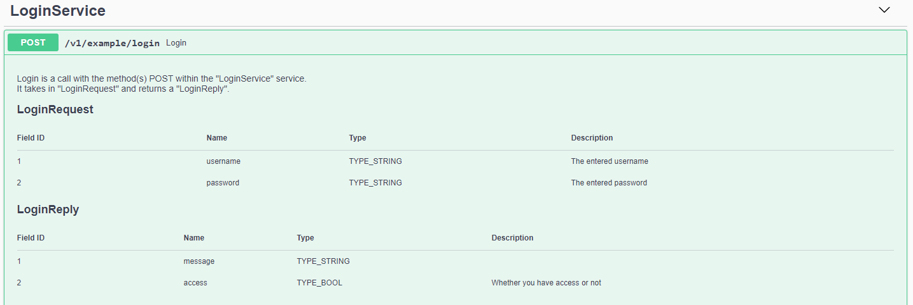



# Customizing OpenAPI Output

## In proto comments

You can provide comments directly in your Protocol Buffer definitions and they will be translated into comments in the generated OpenAPI definitions:

```protobuf
message MyMessage {
  // This comment will end up direcly in your Open API definition
  string uuid = 1 [(grpc.gateway.protoc_gen_openapiv2.options.openapiv2_field) = {description: "The UUID field."}];
}
```

## Using proto options

You can define options on your Protocol Buffer services, operations, messages, enums and field definitions to customize your Open API output. For instance, to customize the [OpenAPI Schema Object](https://swagger.io/specification/v2/#schemaObject) for messages and fields:

```protobuf
import "protoc-gen-openapiv2/options/annotations.proto";

message ABitOfEverything {
    option (grpc.gateway.protoc_gen_openapiv2.options.openapiv2_schema) = {
        json_schema: {
            title: "A bit of everything"
            description: "Intentionaly complicated message type to cover many features of Protobuf."
            required: ["uuid", "int64_value", "double_value"]
        }
        external_docs: {
            url: "https://github.com/grpc-ecosystem/grpc-gateway";
            description: "Find out more about ABitOfEverything";
        }
        example: "{\"uuid\": \"0cf361e1-4b44-483d-a159-54dabdf7e814\"}"
        extensions: {
            key: "x-irreversible";
            value {
                bool_value: true;
            }
        }
    };

    string uuid = 1 [(grpc.gateway.protoc_gen_openapiv2.options.openapiv2_field) = {description: "The UUID field."}];
}
```

Enums can be customized like messages:

```protobuf
// NumericEnum is one or zero.
enum NumericEnum {
  option (grpc.gateway.protoc_gen_openapiv2.options.openapiv2_enum) = {
    json_schema: {
      title: "NumericEnum"
      description: "NumericEnum is one or zero."
      extensions: {
        key: "x-a-bit-of-everything-foo";
        value {
          string_value: "bar";
        }
      }
    }
    external_docs: {
      url: "https://github.com/grpc-ecosystem/grpc-gateway";
      description: "Find out more about ABitOfEverything";
    }
    example: "\"ZERO\""
  };
  // ZERO means 0
  ZERO = 0;
  // ONE means 1
  ONE = 1;
}
```

Operations can also be customized:

```protobuf
service ABitOfEverythingService {
   rpc Delete(grpc.gateway.examples.internal.proto.sub2.IdMessage) returns (google.protobuf.Empty) {
        option (google.api.http) = {
            delete: "/v1/example/a_bit_of_everything/{uuid}"
        };
        option (grpc.gateway.protoc_gen_openapiv2.options.openapiv2_operation) = {
            security: {
                security_requirement: {
                    key: "ApiKeyAuth";
                    value: {}
                }
                security_requirement: {
                    key: "OAuth2";
                    value: {
                        scope: "read";
                        scope: "write";
                    }
                }
            }
            extensions: {
                key: "x-irreversible";
                value {
                    bool_value: true;
                }
            }
        };
    }
}
```

[Swagger Extensions](https://swagger.io/docs/specification/2-0/swagger-extensions/) can be added as key-value pairs to the options. Keys must begin with `x-` and values can be of any type listed [here](https://developers.google.com/protocol-buffers/docs/reference/google.protobuf#value). For example:
```
extensions: {
  key: "x-amazon-apigateway-authorizer";
  value {
    struct_value {
      fields {
        key: "type";
        value {
          string_value: "token";
        }
      }
      fields {
        key: "authorizerResultTtlInSeconds";
        value {
          number_value: 60;
        }
      }
    }
  }
}
```

Please see this [a_bit_of_everything.proto](https://github.com/grpc-ecosystem/grpc-gateway/blob/master/examples/internal/proto/examplepb/a_bit_of_everything.proto) for examples of the options being used.

## Using google.api.field_behavior

Google provides an [field option](https://github.com/googleapis/googleapis/blob/master/google/api/field_behavior.proto) for defining the behavior of fields that is also supported:

```protobuf
import "google/api/field_behavior.proto";

message MyMessage {
    string a_required_field = 1 [(google.api.field_behavior) = REQUIRED];
}
```

The following options are used in the Open API output:

- `REQUIRED` - marks a field as required
- `OUTPUT_ONLY` - marks a field as readonly

Google defines a couple of other options - `OPTIONAL`, `IMMUTABLE`, `INPUT_ONLY` -
that are not currently used. `OPTIONAL` support is currently under discussion
in [this issue](https://github.com/grpc-ecosystem/grpc-gateway/issues/669).

For `IMMUTABLE` and `INPUT_ONLY` fields, there is an [open issue](https://github.com/OAI/OpenAPI-Specification/issues/1497) in the Open API specification for adding functionality for write-once or immutable fields to the spec.
## Using go templates in proto file comments

Use [Go templates](https://golang.org/pkg/text/template/) in your proto file comments to allow more advanced documentation such as:

- Documentation about fields in the proto objects.
- Import the content of external files (such as
  [Markdown](https://en.wikipedia.org/wiki/Markdown)).

### How to use it

By default this function is turned off, so if you want to use it you have to add the `use_go_templates` option:

```sh
--openapiv2_out . --openapiv2_opt use_go_templates=true
```

or:

```sh
--openapiv2_out=use_go_templates=true:.
```

#### Example script

Example of a bash script with the `use_go_templates` flag set to true:

```sh
$ protoc -I. \
    --go_out . --go-grpc_out . \
    --grpc-gateway_out . --grpc-gateway_opt logtostderr=true \
    --openapiv2_out . \
    --openapiv2_opt logtostderr=true \
    --openapiv2_opt use_go_templates=true \
    path/to/my/proto/v1/myproto.proto
```

#### Example proto file

Example of a proto file with Go templates. This proto file imports documentation from another file, `tables.md`:

```protobuf
service LoginService {
    // Login
    //
    // {{.MethodDescriptorProto.Name}} is a call with the method(s) {{$first := true}}{{range .Bindings}}{{if $first}}{{$first = false}}{{else}}, {{end}}{{.HTTPMethod}}{{end}} within the "{{.Service.Name}}" service.
    // It takes in "{{.RequestType.Name}}" and returns a "{{.ResponseType.Name}}".
    //
    // {{import "tables.md"}}
    rpc Login (LoginRequest) returns (LoginReply) {
        option (google.api.http) = {
            post: "/v1/example/login"
            body: "*"
        };
    }
}

message LoginRequest {
    // The entered username
    string username = 1;
    // The entered password
    string password = 2;
}

message LoginReply {
    // Whether you have access or not
    bool access = 1;
}
```

The content of `tables.md`:

```markdown
## {{.RequestType.Name}}
| Field ID    | Name      | Type                                                       | Description                  |
| ----------- | --------- | ---------------------------------------------------------  | ---------------------------- | {{range .RequestType.Fields}}
| {{.Number}} | {{.Name}} | {{if eq .Label.String "LABEL_REPEATED"}}[]{{end}}{{.Type}} | {{fieldcomments .Message .}} | {{end}}  
 
## {{.ResponseType.Name}}
| Field ID    | Name      | Type                                                       | Description                  |
| ----------- | --------- | ---------------------------------------------------------- | ---------------------------- | {{range .ResponseType.Fields}}
| {{.Number}} | {{.Name}} | {{if eq .Label.String "LABEL_REPEATED"}}[]{{end}}{{.Type}} | {{fieldcomments .Message .}} | {{end}}  
```

### OpenAPI output

#### SwaggerUI

This is how the OpenAPI file would be rendered in [Swagger UI](https://swagger.io/tools/swagger-ui/).



#### Postman

This is how the OpenAPI file would be rendered in [Postman](https://www.getpostman.com/).


For a more detailed example of a proto file that has Go, templates enabled, [see the examples](https://github.com/grpc-ecosystem/grpc-gateway/blob/master/examples/internal/proto/examplepb/use_go_template.proto).

## Other plugin options

A comprehensive list of OpenAPI plugin options can be found [here](https://github.com/grpc-ecosystem/grpc-gateway/blob/master/protoc-gen-openapiv2/main.go). Options can be passed via `protoc` CLI:

```sh
--openapiv2_out . --openapiv2_opt bar=baz,color=red
```
 
Or, with `buf` in `buf.gen.yaml`:

```yaml
  - name: openapiv2
    out: foo
    opt: bar=baz,color=red
```

### Merging output

If your protobuf definitions are spread across multiple files, the OpenAPI plugin will create a file for each `.proto` input. This may make sense for Go bindings, since they still share a package space, but fragmenting OpenAPI specifications across multiple files changes the schema itself.

To merge disparate `.proto` inputs into a single OpenAPI file, use the `allow_merge` and `merge_file_name` options.

`opt: allow_merge=true,merge_file_name=foo` will result in a single `foo.swagger.json`. Note that you may need to set
the [generation strategy](https://docs.buf.build/configuration/v1/buf-gen-yaml/#strategy) to `all` when merging many files:

```yaml
  - name: openapiv2
    out: foo
    strategy: all
    opt: allow_merge=true,merge_file_name=foo
```

### Enums as integers

To generate enums as integers instead of strings, use `enums_as_ints`.

`opt: enums_as_ints=true` will result in:


```json
{
    "name": "enumValue",
    "description": " - Example enums",
    "in": "query",
    "required": false,
    "type": "int",
    "enum": [
        0,
        1
    ],
    "default": 0
},
```

### Omitting the default value of enums

If you define enum types with non default value such as declaring 0 value with UNKNOWN and want to omit the default value from generated swagger file, use `omit_enum_default_value`.
This option also applies if enums_as_ints option is enalbled to generate enums as integer.

`opt: omit_enum_default_value=true` will result in:

Input Example:
```
enum enumValue {
    UNKNOWN = 0;
    FOO = 1;
}
```

Output json:
```json
{
    "name": "enumValue",
    "description": " - Example enums",
    "in": "query",
    "required": false,
    "type": "string",
    "enum": [
        "FOO"
    ]
},
```

### Hiding fields, methods, services and enum values

If you require internal or unreleased fields and APIs to be hidden from your API documentation, [`google.api.VisibilityRule`](https://github.com/googleapis/googleapis/blob/9916192ab15e3507e41ba2c5165182fec06120d0/google/api/visibility.proto#L89) annotations can be added to customize where they are generated. Combined with the option `visibility_restriction_selectors`, overlapping rules will appear in the OpenAPI output. 

`visibility_restriction_selectors` can be declared multiple times as an option to include multiple visibility restrictions in the output. 
e.g. if you are using `buf`:

```yaml
version: v1
plugins:
  - name: openapiv2
    out: .
    opt:
      - visibility_restriction_selectors=PREVIEW
      - visibility_restriction_selectors=INTERNAL
```

or with `protoc`

```sh
protoc --openapiv2_out=. --openapiv2_opt=visibility_restriction_selectors=PREVIEW --openapiv2_opt=visibility_restriction_selectors=INTERNAL ./path/to/file.proto
```

Elements without `google.api.VisibilityRule` annotations will appear as usual in the generated output.

These restrictions and selectors are completely arbitrary and you can define whatever values or hierarchies you want. In this example we use `INTERNAL` and `PREVIEW`, but `INTERNAL`, `ALPHA`, `BETA`, `RELEASED`, or anything else could be used if you wish.

Note: Annotations are only supported on Services, Methods, Fields and Enum Values.

`opt: visibility_restriction_selectors=PREVIEW` will result in:

Input Example:
```protobuf
service Echo {
    rpc EchoInternal(VisibilityRuleSimpleMessage) returns (VisibilityRuleSimpleMessage) {
        option (google.api.method_visibility).restriction = "INTERNAL";
        option (google.api.http) = {
            get: "/v1/example/echo_internal"
        };
    }
    rpc EchoInternalAndPreview(VisibilityRuleSimpleMessage) returns (VisibilityRuleSimpleMessage) {
        option (google.api.method_visibility).restriction = "INTERNAL,PREVIEW";
        option (google.api.http) = {
            get: "/v1/example/echo_internal_and_preview"
        };
    }
}

message VisibilityRuleSimpleMessage {
     enum VisibilityEnum {
          UNSPECIFIED = 0;
          VISIBLE = 1;
          INTERNAL = 2 [(google.api.value_visibility).restriction = "INTERNAL"];
          PREVIEW = 3 [(google.api.value_visibility).restriction = "INTERNAL,PREVIEW"];
     }
     
     string internal_field = 1 [(google.api.field_visibility).restriction = "INTERNAL"];
     string preview_field = 2 [(google.api.field_visibility).restriction = "INTERNAL,PREVIEW"];
     VisibilityEnum an_enum = 3;
}
```

Output json:
```json
{
    "paths": {
        "/v1/example/echo_internal_and_preview": {
            "get": {
                "summary": "EchoInternalAndPreview is a internal and preview API that should be visible in the OpenAPI spec.",
                "operationId": "VisibilityRuleEchoService_EchoInternalAndPreview",
                "responses": {
                    "200": {
                        "description": "A successful response.",
                        "schema": {
                        "$ref": "#/definitions/examplepbVisibilityRuleSimpleMessage"
                        }
                    },
                    "default": {
                        "description": "An unexpected error response.",
                        "schema": {
                            "$ref": "#/definitions/rpcStatus"
                        }
                    }
                },
                "parameters": [
                    {
                        "name": "previewField",
                        "in": "query",
                        "required": false,
                        "type": "string"
                    },
                    {
                        "name": "anEnum",
                        "in": "query",
                        "required": false,
                        "type": "string",
                        "enum": [
                            "UNSPECIFIED",
                            "VISIBLE",
                            "PREVIEW"
                        ],
                        "default": "UNSPECIFIED"
                    }
                ],
                "tags": [
                    "VisibilityRuleEchoService"
                ]
            }
        }
    }
}
```

For a more in depth example see [visibility_rule_echo_service.proto](https://github.com/grpc-ecosystem/grpc-gateway/blob/master/examples/internal/proto/examplepb/visibility_rule_echo_service.proto) and the following output files for different values of `visibility_restriction_selectors`:
- [`visibility_restriction_selectors=PREVIEW`](https://github.com/grpc-ecosystem/grpc-gateway/blob/master/examples/internal/proto/examplepb/visibility_rule_preview_echo_service.swagger.json)
- [`visibility_restriction_selectors=INTERNAL`](https://github.com/grpc-ecosystem/grpc-gateway/blob/master/examples/internal/proto/examplepb/visibility_rule_internal_echo_service.swagger.json)
- [`visibility_restriction_selectors=INTERNAL,visibility_restriction_selectors=PREVIEW`](https://github.com/grpc-ecosystem/grpc-gateway/blob/master/examples/internal/proto/examplepb/visibility_rule_preview_and_internal_echo_service.swagger.json)
- [Not set](https://github.com/grpc-ecosystem/grpc-gateway/blob/master/examples/internal/proto/examplepb/visibility_rule_none_echo_service.swagger.json)

### Path parameters

When defining HTTP bindings with path parameters that contain multiple path segments, as suggested by the [Google AIPs](https://google.aip.dev/), the path parameter names are numbered to avoid generating duplicate paths in the OpenAPI file.

For example, consider:
```protobuf
service LibraryService {
  rpc GetShelf(GetShelfRequest) returns (Shelf) {
    option (google.api.http) = {
      get: "/v1/{name=shelves/*}"
    };
  }
  rpc GetBook(GetBookRequest) returns (Book) {
    option (google.api.http) = {
      get: "/v1/{name=shelves/*/books/*}"
    };
  }
}

message GetShelfRequest {
  string name = 1;
}

message GetBookRequest {
  string name = 1;
}
```

This will generate the following paths:
- `/v1/{name}`
- `/v1/{name_1}`

To override the path parameter names, annotate the field used as path parameter:
```protobuf
message GetShelfRequest {
  string name = 1 [(grpc.gateway.protoc_gen_openapiv2.options.openapiv2_field) = {field_configuration: {path_param_name: "shelfName"}}];
}
message GetBookRequest {
  string name = 1 [(grpc.gateway.protoc_gen_openapiv2.options.openapiv2_field) = {field_configuration: {path_param_name: "bookName"}}];
}
```

This will instead generate the following paths:
- `/v1/{shelfName}`
- `/v1/{bookName}`

Note that path parameters in OpenAPI does not support values with `/`, as discussed in
[Support for path parameters which can contain slashes #892](https://github.com/OAI/OpenAPI-Specification/issues/892),
so tools as Swagger UI will URL encode any `/` provided as parameter value. A possible workaround for this is to write
a custom post processor for your OAS file to replace any path parameter with `/` into multiple parameters.

### Output format

By default the output format is JSON, but it is possible to configure it using the `output_format` option. Allowed values are: `json`, `yaml`. The output format will also change the extension of the output files.

For example, if using `buf`:
```yaml
  - name: openapiv2
    out: pkg
    opt: output_format=yaml
```

Input example:
```protobuf
syntax = "proto3";

package helloproto.v1;
option go_package = "helloproto/v1;helloproto";

import "google/api/annotations.proto";

service EchoService {
    rpc Hello(HelloReq) returns (HelloResp) {
        option (google.api.http) = {
            get: "/api/hello"
        };
    }
}

message HelloReq {
    string name = 1;
}

message HelloResp {
    string message = 1;
}
```

Output:
```yaml
swagger: "2.0"
info:
  title: helloproto/v1/example.proto
  version: version not set
tags:
- name: EchoService
consumes:
- application/json
produces:
- application/json
paths:
  /api/hello:
    get:
      operationId: EchoService_Hello
      responses:
        "200":
          description: A successful response.
          schema:
            $ref: '#/definitions/v1HelloResp'
        default:
          description: An unexpected error response.
          schema:
            $ref: '#/definitions/rpcStatus'
      parameters:
      - name: name
        in: query
        required: false
        type: string
      tags:
      - EchoService
definitions:
  protobufAny:
    type: object
    properties:
      '@type':
        type: string
    additionalProperties: {}
  rpcStatus:
    type: object
    properties:
      code:
        type: integer
        format: int32
      message:
        type: string
      details:
        type: array
        items:
          $ref: '#/definitions/protobufAny'
  v1HelloResp:
    type: object
    properties:
      message:
        type: string
```



