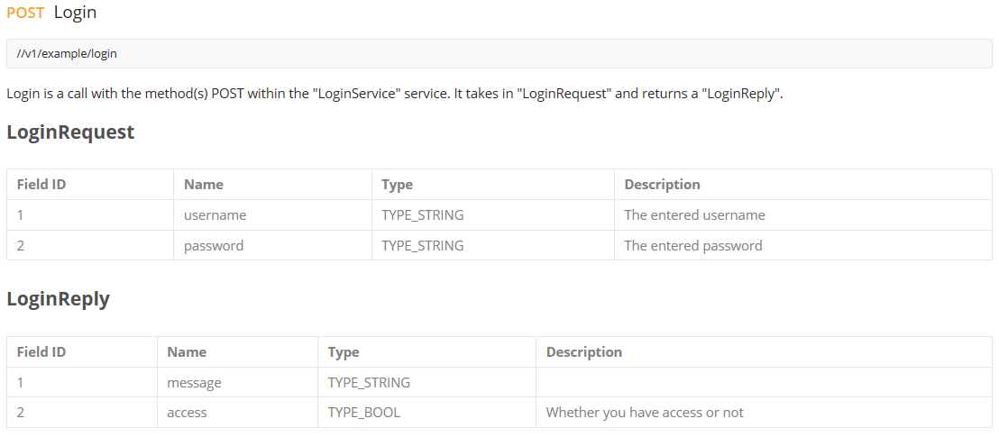



# Customizing OpenAPI Output

## In proto comments

You can provide comments directly in your Protocol Buffer definitions and they will be translated into comments in the generated OpenAPI definitions:

```protobuf
message MyMessage {
  // This comment will end up direcly in your Open API definition
  string uuid = 1 [(grpc.gateway.protoc_gen_openapiv2.options.openapiv2_field) = {description: "The UUID field."}];
}
```

## Using proto options

You can define options on your Protocol Buffer services, operations, messages, and field definitions to customize your Open API output. For instance, to customize the [OpenAPI Schema Object](https://swagger.io/specification/v2/#schemaObject) for messages and fields:

```protobuf
import "protoc-gen-openapiv2/options/annotations.proto";

message ABitOfEverything {
    option (grpc.gateway.protoc_gen_openapiv2.options.openapiv2_schema) = {
        json_schema: {
            title: "A bit of everything"
            description: "Intentionaly complicated message type to cover many features of Protobuf."
            required: ["uuid", "int64_value", "double_value"]
        }
        external_docs: {
            url: "https://github.com/grpc-ecosystem/grpc-gateway";
            description: "Find out more about ABitOfEverything";
        }
        example: "{\"uuid\": \"0cf361e1-4b44-483d-a159-54dabdf7e814\"}"
    };

    string uuid = 1 [(grpc.gateway.protoc_gen_openapiv2.options.openapiv2_field) = {description: "The UUID field."}];
}
```

Operations can also be customized:

```protobuf
service ABitOfEverythingService {
   rpc Delete(grpc.gateway.examples.internal.proto.sub2.IdMessage) returns (google.protobuf.Empty) {
        option (google.api.http) = {
            delete: "/v1/example/a_bit_of_everything/{uuid}"
        };
        option (grpc.gateway.protoc_gen_openapiv2.options.openapiv2_operation) = {
            security: {
                security_requirement: {
                    key: "ApiKeyAuth";
                    value: {}
                }
                security_requirement: {
                    key: "OAuth2";
                    value: {
                        scope: "read";
                        scope: "write";
                    }
                }
            }
            extensions: {
                key: "x-irreversible";
                value {
                    bool_value: true;
                }
            }
        };
    }
}
```

Please see this [a_bit_of_everything.proto](https://github.com/grpc-ecosystem/grpc-gateway/blob/master/examples/internal/proto/examplepb/a_bit_of_everything.proto) for examples of the options being used.

## Using google.api.field_behavior

Google provides an [field option](https://github.com/googleapis/googleapis/blob/master/google/api/field_behavior.proto) for defining the behavior of fields that is also supported:

```protobuf
import "google/api/field_behavior.proto";

message MyMessage {
    string a_required_field = 1 [(google.api.field_behavior) = REQUIRED];
}
```

The following options are used in the Open API output:

- `REQUIRED` - marks a field as required
- `OUTPUT_ONLY` - marks a field as readonly

Google defines a couple of other options - `OPTIONAL`, `IMMUTABLE`, `INPUT_ONLY` -
that are not currently used. `OPTIONAL` support is currently under discussion
in [this issue](https://github.com/grpc-ecosystem/grpc-gateway/issues/669).

For `IMMUTABLE` and `INPUT_ONLY` fields, there is an [open issue](https://github.com/OAI/OpenAPI-Specification/issues/1497) in the Open API specification for adding functionality for write-once or immutable fields to the spec.
## Using go templates in proto file comments

Use [Go templates](https://golang.org/pkg/text/template/) in your proto file comments to allow more advanced documentation such as:

- Documentation about fields in the proto objects.
- Import the content of external files (such as
  [Markdown](https://en.wikipedia.org/wiki/Markdown)).

### How to use it

By default this function is turned off, so if you want to use it you have to add the `use_go_templates` option:

```sh
--openapiv2_out . --openapiv2_opt use_go_templates=true
```

or:

```sh
--openapiv2_out=use_go_templates=true:.
```

#### Example script

Example of a bash script with the `use_go_templates` flag set to true:

```sh
$ protoc -I. \
    --go_out . --go-grpc_out . \
    --grpc-gateway_out . --grpc-gateway_opt logtostderr=true \
    --openapiv2_out . \
    --openapiv2_opt logtostderr=true \
    --openapiv2_opt use_go_templates=true \
    path/to/my/proto/v1/myproto.proto
```

#### Example proto file

Example of a proto file with Go templates. This proto file imports documentation from another file, `tables.md`:

```protobuf
service LoginService {
    // Login
    //
    // {{.MethodDescriptorProto.Name}} is a call with the method(s) {{$first := true}}{{range .Bindings}}{{if $first}}{{$first = false}}{{else}}, {{end}}{{.HTTPMethod}}{{end}} within the "{{.Service.Name}}" service.
    // It takes in "{{.RequestType.Name}}" and returns a "{{.ResponseType.Name}}".
    //
    // {{import "tables.md"}}
    rpc Login (LoginRequest) returns (LoginReply) {
        option (google.api.http) = {
            post: "/v1/example/login"
            body: "*"
        };
    }
}

message LoginRequest {
    // The entered username
    string username = 1;
    // The entered password
    string password = 2;
}

message LoginReply {
    // Whether you have access or not
    bool access = 1;
}
```

The content of `tables.md`:

```markdown
## {{.RequestType.Name}}
| Field ID    | Name      | Type                                                       | Description                  |
| ----------- | --------- | ---------------------------------------------------------  | ---------------------------- | {{range .RequestType.Fields}}
| {{.Number}} | {{.Name}} | {{if eq .Label.String "LABEL_REPEATED"}}[]{{end}}{{.Type}} | {{fieldcomments .Message .}} | {{end}}  
 
## {{.ResponseType.Name}}
| Field ID    | Name      | Type                                                       | Description                  |
| ----------- | --------- | ---------------------------------------------------------- | ---------------------------- | {{range .ResponseType.Fields}}
| {{.Number}} | {{.Name}} | {{if eq .Label.String "LABEL_REPEATED"}}[]{{end}}{{.Type}} | {{fieldcomments .Message .}} | {{end}}  
```

### OpenAPI output

#### SwaggerUI

This is how the OpenAPI file would be rendered in [Swagger UI](https://swagger.io/tools/swagger-ui/).


#### Postman

This is how the OpenAPI file would be rendered in [Postman](https://www.getpostman.com/).



For a more detailed example of a proto file that has Go, templates enabled, [see the examples](https://github.com/grpc-ecosystem/grpc-gateway/blob/master/examples/internal/proto/examplepb/use_go_template.proto).

## Other plugin options

A comprehensive list of OpenAPI plugin options can be found [here](https://github.com/grpc-ecosystem/grpc-gateway/blob/master/protoc-gen-openapiv2/main.go). Options can be passed via `protoc` CLI:

```sh
--openapiv2_out . --openapiv2_opt bar=baz,color=red
```
 
Or, with `buf` in `buf.gen.yaml`:

```yaml
  - name: openapiv2
    out: foo
    opt: bar=baz,color=red
```

### Merging output

If your protobuf definitions are spread across multiple files, the OpenAPI plugin will create a file for each `.proto` input. This may make sense for Go bindings, since they still share a package space, but fragmenting OpenAPI specifications across multiple files changes the schema itself.

To merge disparate `.proto` inputs into a single OpenAPI file, use the `allow_merge` and `merge_file_name` options.

`opt: allow_merge=true,merge_file_name=foo` will result in a single `foo.swagger.json`. Note that you may need to set
the [generation strategy](https://docs.buf.build/configuration/v1/buf-gen-yaml/#strategy) to `all` when merging many files:

```yaml
  - name: openapiv2
    out: foo
    strategy: all
    opt: allow_merge=true,merge_file_name=foo
```

### Enums as integers

To generate enums as integers instead of strings, use `enums_as_ints`.

`opt: enums_as_ints=true` will result in:


```json
{
    "name": "enumValue",
    "description": " - Example enums",
    "in": "query",
    "required": false,
    "type": "int",
    "enum": [
        0,
        1
    ],
    "default": 0
},
```

